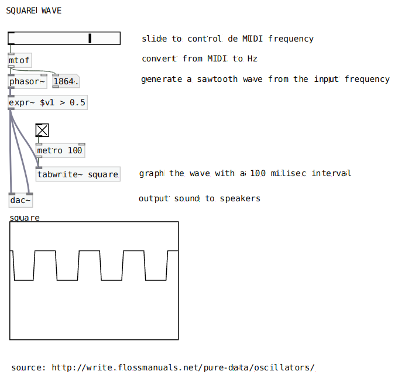
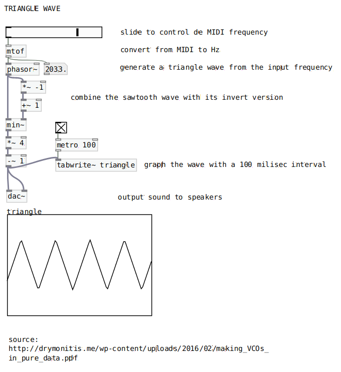

# Oscillators

*Implementations of different kinds of oscillators.*

## Sine Wave Oscillator

### Pure Data

## Sawtooth Wave Oscillator

### Pure Data

## Square Wave Oscillator

### Pure Data

## Triangle Wave Oscillator

### Pure Data

