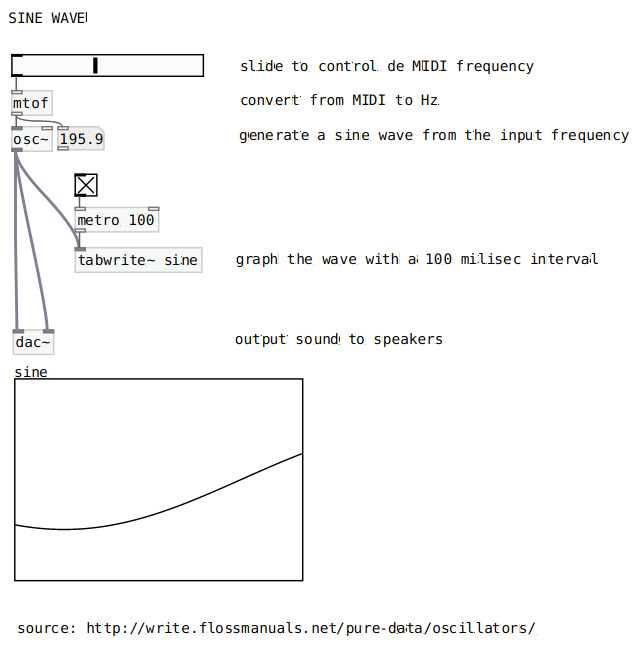
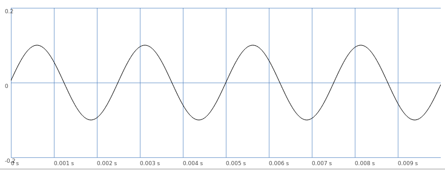
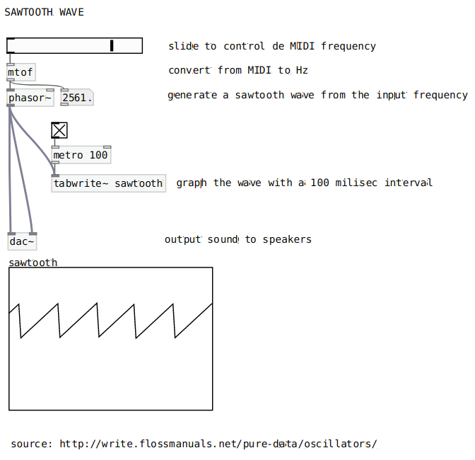
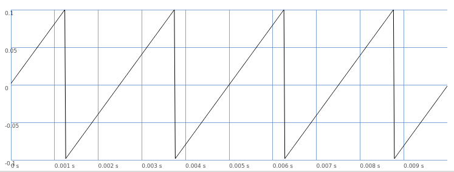
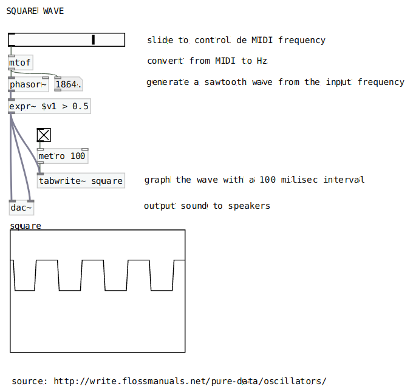
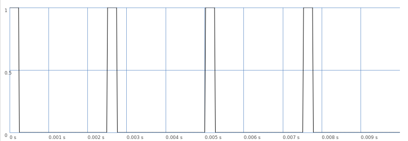
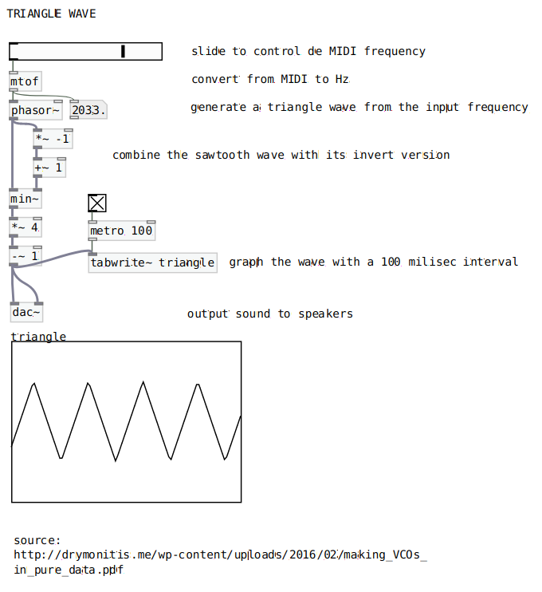
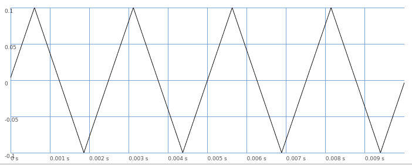

# Oscillators

*Implementations of different kinds of oscillators.*

## Sine Wave Oscillator

### Pure Data

### SuperCollider

## Sawtooth Wave Oscillator

### Pure Data

### SuperCollider

## Square Wave Oscillator

### Pure Data

### SuperCollider

## Triangle Wave Oscillator

### Pure Data

### SuperCollider

